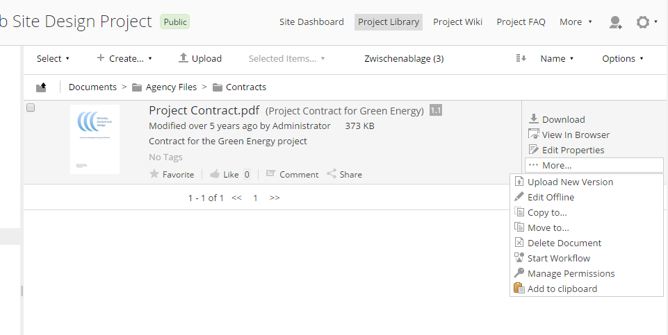
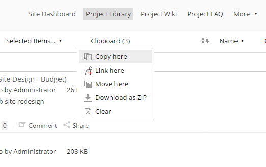

# Alfresco Share Clipboard

This extensions adds a Clipboard to the Alfresco Share document library that allows collecting documents.

### Usage

Use the document library action to add files to the clipboard

Files are added to the clipboard view in the left sidebar of the document library

An additional clipboard menu can be used to copy, move, link or zip the clipboard contents.

## Building

To build both the Repository and Share AMP files run
  
    mvn clean package

### Local development system

* Execute run script of alfresco-clipboard-repo. Alfresco repository will be startet and is accessible at `http://localhost:8080/alfresco`
* Execute run script of alfresco-clipboard-share. Alfresco share will be startet and is accessible at `http://localhost:8081/share`

To enable the Clipboard go to the Share Module Management Compontent and enable the Share Clipboard: `http://localhost:8081/share/page/modules/deploy`

## Installation

Build alfresco-clipboard-repo AMP and alfresco-clipboard-share AMP (see section Building). 
* Copy alfresco-clipboard-repo to `amps` directory of your webserver instance.
* Copy alfresco-clipboard-share to `amps_share` directory of your webserver instance.
* Apply extension modules using the `bin/apply_amps.[sh|bat]`on your server.
* Restart webserver
* Enable the Clipboard: Go to the Share Module Management Compontent and enable the Share Clipboard: `http://<yourserver>/share/page/modules/deploy`
